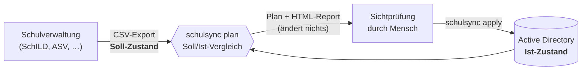
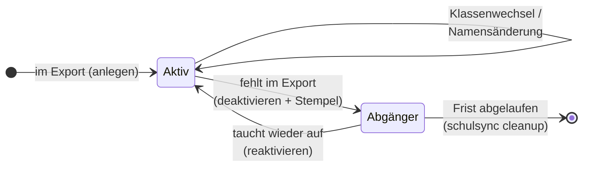

# Funktionsweise & Designentscheidungen

## Das Grundprinzip: deklarativ statt imperativ

SchulSync arbeitet wie Terraform, nur für Schülerkonten. Man beschreibt
nicht, *was zu tun ist* („lege Konto an", „verschiebe nach 6A"), sondern
*wie der Zielzustand aussieht* – und der steht bereits in der
Schulverwaltung. SchulSync berechnet die Differenz:



Daraus folgen drei Eigenschaften, die im Schulalltag Gold wert sind:

* **Idempotenz** – derselbe Export zweimal eingespielt ergibt beim
  zweiten Mal einen leeren Plan. Ein abgebrochener Lauf? Einfach noch
  einmal starten.
* **Kein Sonderfall „Schuljahreswechsel"** – ob ein Kind zuzieht, die
  Klasse wechselt oder 600 Konten aufrücken: es ist immer derselbe
  Soll/Ist-Vergleich, nur die Größe des Plans ändert sich.
* **Prüfbarkeit** – der Plan existiert *vor* der Ausführung, als
  Terminal-Ausgabe und als HTML-Report für die Ablage.

## Der stabile Schlüssel: `employeeNumber`

Namen ändern sich (Heirat, Korrekturen), Klassen sowieso. Das einzig
Stabile ist die ID der Schulverwaltung (SchILD: „Interne ID-Nummer",
ASV: „Schülernummer"). Sie wird bei der Kontoanlage ins AD-Attribut
`employeeNumber` geschrieben und ist ab dann der Join-Schlüssel zwischen
beiden Welten. Deshalb übersteht ein Konto jede Namensänderung, ohne
dass jemand sein Passwort oder seine Dateien verliert.

## Warum `CN = Benutzername`?

Der klassische Ansatz `CN=Vorname Nachname` platzt, sobald zwei Kinder
gleichen Namens in derselben OU landen (RDN-Kollision – und bei 600
Schüler:innen passiert das). Der Benutzername ist dagegen per
Konstruktion domänenweit eindeutig. Der „schöne" Name steht in
`displayName`, wo Menschen ihn sehen.

## Benutzernamen: Regeln aus 16 Jahren Schulbetrieb

* Schema konfigurierbar, Standard `vorname.nachname`, alles klein.
* Transliteration statt Zeichensalat: `Müller → mueller`,
  `Yılmaz → yilmaz`, `Đorđević → dordevic`, `Łukasz → lukasz`.
  Schulen sind vielfältig – Benutzernamen müssen es aushalten.
* `sAMAccountName` ist seit NT-Zeiten auf **20 Zeichen** begrenzt.
  SchulSync kürzt sauber, bevor das AD kryptisch ablehnt.
* Kollisionen bekommen einen Zähler (`emma.fischer2`) – geprüft gegen
  **alle** Benutzernamen der Domäne, nicht nur die eigenen. Die neue
  Fünftklässlerin darf auch mit dem Hausmeisterkonto nicht kollidieren.

## Reihenfolge im `apply` – Schadensbegrenzung eingebaut

1. **Struktur** (OUs, Gruppen) – ohne sie geht nichts.
2. **Reaktivieren** – Rückkehrer belegen ihren alten Benutzernamen wieder.
3. **Anlegen** – neue Konten, Initialpasswörter, Gruppen.
4. **Umbenennen** – ändert nur Attribute, nie den DN (CN = Benutzername!).
5. **Verschieben** – OU-Umzug + Klassengruppen-Tausch.
6. **Deaktivieren** – zum Schluss, wenn alles andere schon steht.

Bricht ein Lauf mittendrin ab (Netz weg, DC-Neustart), ist nichts
Halbes entstanden, das der nächste idempotente Lauf nicht reparieren
würde. Einzelfehler werden gesammelt statt den Lauf zu stoppen – am
Ende steht eine ehrliche Bilanz.

## Die Notbremse

Der gefährlichste Fehler im Schulalltag ist kein Angriff, sondern ein
**halber Export**: falsche Berichtsvorlage, nur eine Klasse markiert,
Download abgebrochen. Ein naives Sync-Tool würde daraufhin brav 90 %
der Schule deaktivieren. SchulSync blockiert Pläne, die mehr als die
Hälfte der aktiven Konten deaktivieren würden, als Konflikt –
`--ohne-notbremse` bleibt für den echten Ausnahmefall.

## Lebenszyklus & Löschkonzept



Details und DSGVO-Einordnung: [dsgvo.md](dsgvo.md).

## Exit-Codes

| Code | Bedeutung |
|---|---|
| 0 | Erfolg bzw. keine Abweichungen |
| 1 | Fehler (Konfiguration, CSV, LDAP) |
| 2 | Konflikte im Plan – manuelle Klärung, nichts wurde geändert |
| 3 | nur `plan --check`: es gibt Abweichungen |

`plan --check` macht SchulSync cron-tauglich: ein nächtlicher Lauf, der
bei Abweichungen Exit 3 liefert, lässt sich in jedes Monitoring hängen
(„Schulverwaltung und AD driften auseinander").

## OU-Layout im AD

```
DC=schule,DC=local
└── OU=SchulSync                    ← alles darunter gehört SchulSync
    ├── OU=Schueler
    │   ├── OU=5A   (CN=lina.aydin, …)
    │   ├── OU=5B …
    ├── OU=Lehrkraefte
    ├── OU=Abgaenger                ← deaktiviert, mit Frist-Stempel
    ├── CN=Klasse-5A  (Gruppe)
    ├── CN=Alle-Schueler (Gruppe)
    └── CN=Alle-Lehrkraefte (Gruppe)
```

Konten **außerhalb** der SchulSync-OU fasst das Tool grundsätzlich
nicht an – Sekretariat, Dienstkonten und Admins leben unbehelligt
daneben. Das Dienstkonto braucht daher auch nur auf diese eine OU
delegierte Rechte, keinen Domain-Admin.
